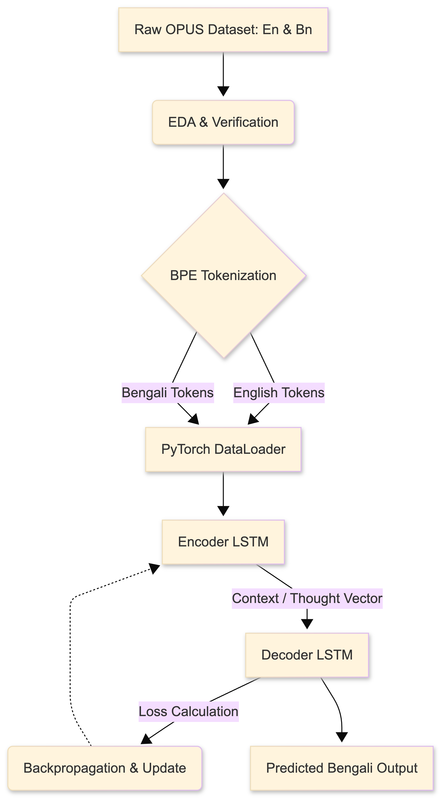

# Project Engineering Journal

This document contains the system architecture, daily task tracker, and conceptual logs.

## 1. System Architecture (Process Tree)

## 2. Progress Tracker

### 🔴 TODO
- [ ] Implement Encoder LSTM class in PyTorch.
- [ ] Implement Decoder LSTM class with basic routing.
- [ ] Write the training loop (Epochs, Optimizer, CrossEntropyLoss).
- [ ] Calculate baseline BLEU score on test set.
- [ ] Begin Transformer implementation.

### 🟡 IN PROGRESS
- [ ] Reviewing PyTorch documentation for `nn.LSTM` and `nn.Embedding`.

### 🟢 DONE
- **Jun 24, 2026**: Initialized Git repository and planned system architecture.
- **Jun 24, 2026**: Created `preprocess.py` to train Byte-Pair Encoding (BPE) tokenizers on English and Bengali independently.
- **Jun 24, 2026**: Built `dataset.py` implementing dynamic batch padding via a custom `collate_fn`.
- **Jun 24, 2026**: Wrote `eda.ipynb` to verify dataset alignment and plot sentence length distributions. Max sequence length is ~35 words, guaranteeing safe memory constraints.

---

## 3. Concept & Problem-Solving Log

### Concept 1: Byte-Pair Encoding (BPE)
**The Problem:** Neural networks can't read letters, and feeding them whole words requires massive memory (millions of vocabulary words).
**The Solution:** BPE tokenization. It breaks down common words into sub-word chunks (e.g., "un" + "happi" + "ness"). This allows the model to handle unseen words and typos without exploding the vocabulary size. We constrained our vocab to 10,000 chunks per language.

### Concept 2: Dynamic Batch Padding (`collate_fn`)
**The Problem:** PyTorch requires all data in a single batch (e.g., 32 sentences) to be exactly the same length so it can form a perfect matrix. If we blindly pad every sentence in the dataset to 100 words, we waste massive amounts of RAM storing zeroes (`[PAD]`).
**The Solution:** We wrote a custom `collate_fn` in `dataset.py`. It looks at a batch of 32 sentences, finds the longest sentence *in that specific batch* (e.g., 14 words), and only pads the other 31 sentences up to 14 words. This drastically reduces memory consumption during training.
